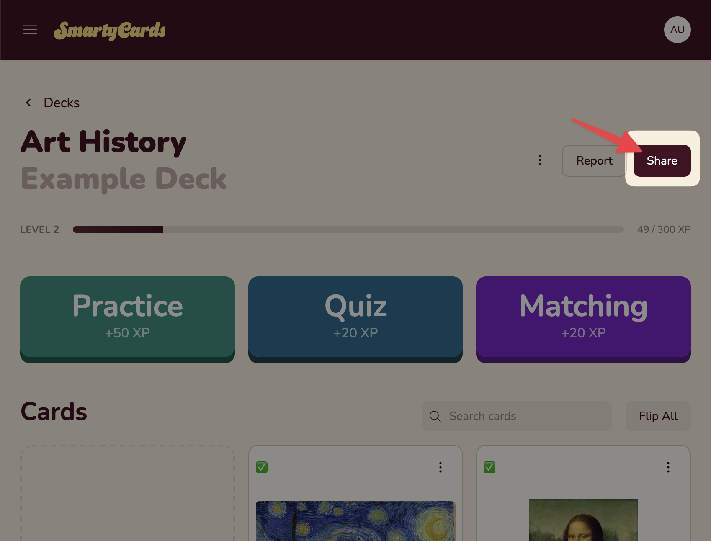
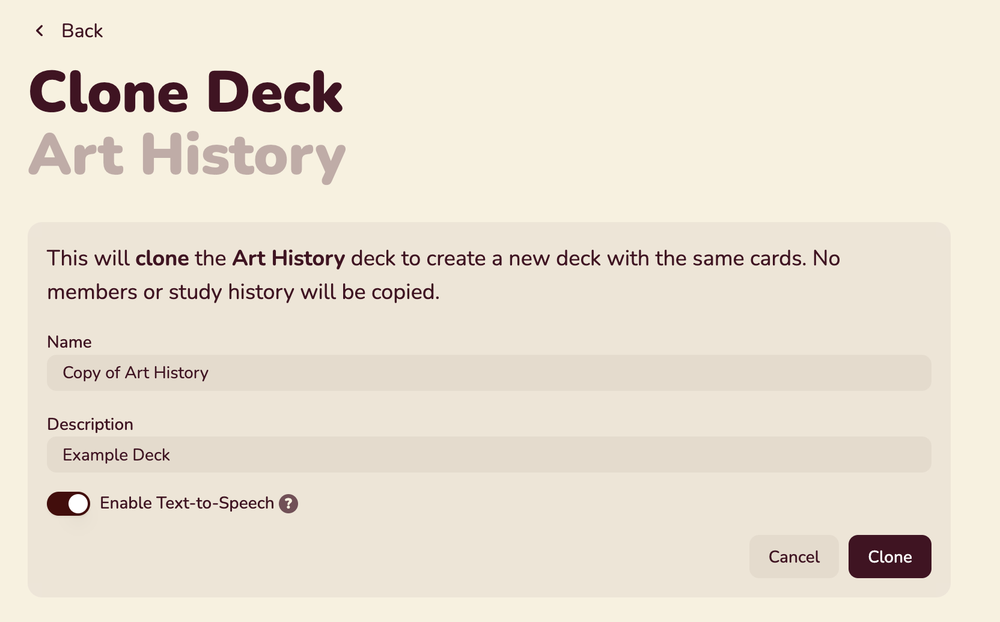

# Sharing Decks

[Deck owners](#deck-roles-and-permissions) can invite other users to view or collaborate on their deck.

To start sharing, click `Share` on your deck's page.

::: info
Users with **view-only** permissions to a deck cannot invite others, or see the list of members. See [Deck Roles and Permissions](#deck-roles-and-permissions) for details.
:::

On the Share page, you'll see two sections: Invite and Members

## Invite

Deck members can have three roles:

- **owner** – the deck creator, with full permissions
- **editor** - can add, remove, and edit deck cards
- **viewer** - can view the deck, practice, and play

In the invite section, you'll see a `View` invite links and an `Edit` invite link.

Share the link with users you wish to invite. Once they click on them (and sign in), they'll join your deck.

::: tip
Accidentally shared a link? Need to stop members from joining? Click the <IconRefresh /> refresh icon next to the link to generate a new link.
:::

## Cloning Decks

Any deck member can use `clone` to make a fresh copy of a deck of their own. No practice history or members will copied.

To clone a deck:

1. Choose `⋮` and select `Clone`. You will be prompted for the name and description of the new deck.

   

2. Give your cloned deck a name and description and click `Clone` to save:

   

## Members List

Below the invites, are a list of all current deck members and their roles.

Deck owners can promote, demote, or remove users in this list.

## Deck Roles and Permissions

Here's a more granular list of what deck owners, editors, and viewers can do:

| Permission                                       | Owner | Editor | Viewer |
| :----------------------------------------------- | ----- | ------ | ------ |
| **DECK**                                         |       |        |        |
| Delete Deck                                      | x     | -      | -      |
| Change deck name/description                     | x     | -      | -      |
| Add/Remove/Edit Cards                            | x     | x      | -      |
| Clone deck (make their own copy)                 | x     | x      | x      |
| **REPORTING**                                    |       |        |        |
| view avg card score (all members)                | x     | -      | -      |
| member participation summary                     | x     | -      | -      |
| **SHARING**                                      |       |        |        |
| share deck with others                           | x     | -      | -      |
| view member list                                 | x     | -      | -      |
| promote/demote members (up to the same level) | x     | -      | -      |
| remove members                                   | x     | -      | -      |
| reset share links                                | x     | -      | -      |
| **ACTIVITIES**                                   |       |        |        |
| Practice Deck                                    | x     | x      | x      |
| Quiz                                             | x     | x      | x      |
| Matching                                         | x     | x      | x      |

## Which role should I use?

It depends on your goal. Here are a few common scenarios.

#### Self-Study

You've created a deck as a self-study tool and want to share it with a friend to help them study, but don't want them to change anything.

- **Viewers** – friends, study group

They will see your new cards, but won't be able to edit. Their practice and play history will be separate from your own.

They can `Clone` your deck if they wish to have a copy of their own.

#### Class Study

You've create a deck to help your class practice and study.

- **Owners** – TA's or instructional support staff to help you create/edit cards, and manage invites.
- **Viewers** – Students

:::tip
Post your `View` invite link or [`Embed` a practice activity](./teaching/using-with-canvas.md) in your Canvas classroom, so that students can add themselves.
:::

#### Collaborative Study

Many hands make light work, and smartycards makes it easy to build a deck together, as a classroom activity or with a small study group.

- **Editors** – friends, study group, students
