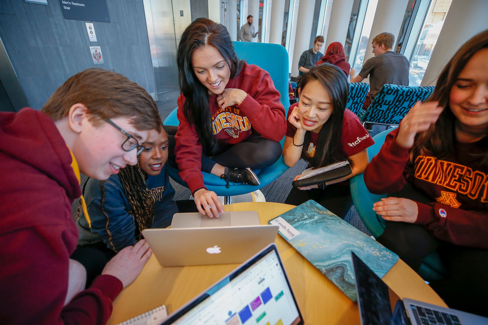

# Classroom Activities with SmartyCards

## Collaborative Deck Creation

- **Goal:** Promote teamwork and review course concepts.
- **Activity:** Assign groups of students with different topics and have each group create a set of flashcards covering key terms, concepts, or theories related to that topic.
- **Variation:** For a twist, have each group create "challenge" flashcards for other groups, including advanced or tricky questions that require critical thinking.

## Abstract to Concrete

- **Goal:** Help students understand abstract concepts through illustrations and examples.
- **Activity:** Provide students with a set of abstract concepts or theories and have them add illustrations, descriptions, and examples to make the concepts clear.
- **Variation:** Have students test their examples by swapping decks and testing to see if others can guess the concept based on their illustration.

## Flashcard Scavenger Hunt

- **Goal**: Improve research and comprehension skills.
- **Activity**: Provide students with a list of people, chapters, or concepts and have them create flashcards based on your list. Afterward, have students share their decks and use the quiz tool to test their knowledge.

## Study Decks

- **Goal**: Teamwork and review course concepts.
- **Activity**: Individually or in groups, have students generate a set number of flashcards and share with the class. Use the deck and quiz tool to review for exams.
- **Variation**: Have groups swap decks for a peer review to ensure all decks that go into the review session are accurate.

## Scenario-Based Flashcard Learning

- **Goal:** Apply knowledge in real-world situations.
- **Activity:** Generate flashcards that present problem-solving scenarios related to a subject (e.g., "You’re in a clinical setting with a patient exhibiting these symptoms…"). Participants must use their knowledge to choose the right action or solution, using the information from the flashcards to guide their choices.

## Timed Flashcard Race

- **Goal:** Improve speed of recall and decision-making.
- **Activity:** Use a timed mode where participants must answer as many flashcards as possible in a set period (e.g., 2 minutes).

## Fix my Deck

- **Goal:** Encourage review by adding information
- **Activity:** Give students incomplete flashcards and have them add images, videos, sound, hints, or answers to create a usable deck.
- **Variation:** Have students create flashcards individually or in groups and then swap with a peer who adds their own hint, mnemonic device, or way of remembering.

## Flashcard Storytelling

- **Goal:** Foster creativity and storytelling.
- **Activity:** Participants use flashcards from a deck (e.g., historical events, images, scientific concepts, character traits) to create a coherent story. Each flashcard introduces a new element or plot twist, requiring participants to think creatively while reinforcing knowledge of the content.

## Flashcard Presentation

- **Goal:** Synthesize knowledge by teaching others.
- **Activity:** Participants study a deck and then present the content to the group as if they were teaching or lecturing on the topic. This demonstrates how well they’ve internalized the content and allows for collaborative learning, as others can ask questions or challenge ideas.

## Role-Play with Flashcards

- **Goal**: Deepen understanding by thinking from different perspectives.
- **Activity**: Assign each student or group a “role” or perspective related to the content (e.g., historical figures, stakeholders in a debate, or characters in a novel). Have them create flashcards that reflect that perspective or that character’s interests.
- **Variation**: During a class review, students present or debate using the flashcards “in character”

## Flashcard Pictionary

- **Goal**: Reinforce concepts visually and creatively.
- **Activity**: Have students draw images to represent concepts then take a picture and upload those images to their flashcards and add the concept to the back of the card. Have teams compete to see how many of their cards can be guessed. This activity works well for vocabulary or symbol-heavy subjects, like anatomy, chemistry, or languages.
