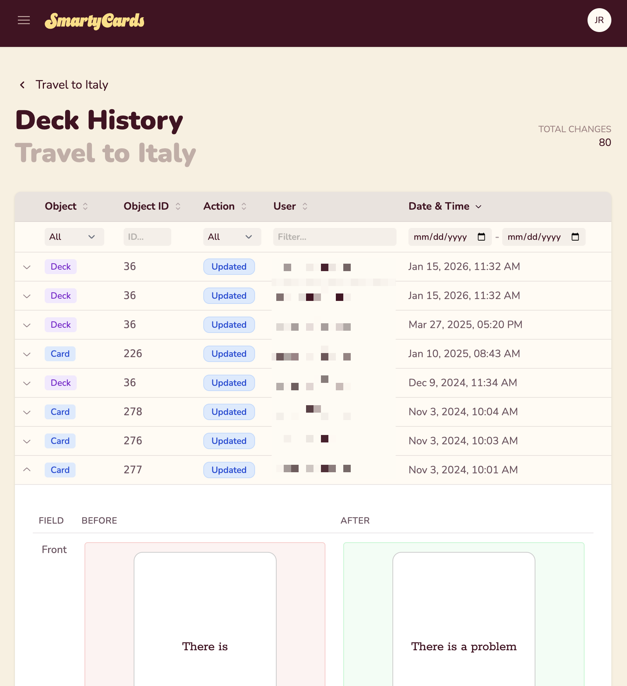

# Deck History

SmartyCards keeps a history of all changes made to a deck. This helps you track edits, review who made changes, and understand how your deck has evolved over time.

::: info
Only **Deck Owners** can view the deck history.
:::

## What's Tracked

The deck history shows record of all changes, including:

- The type of action performed (create, edit, delete)
- Who made the change
- When the change occurred

## Accessing Deck History

To view the history for a deck:

1. Open the deck you want to review
2. Click the `⠇` (More Actions) button
3. Select **History**

