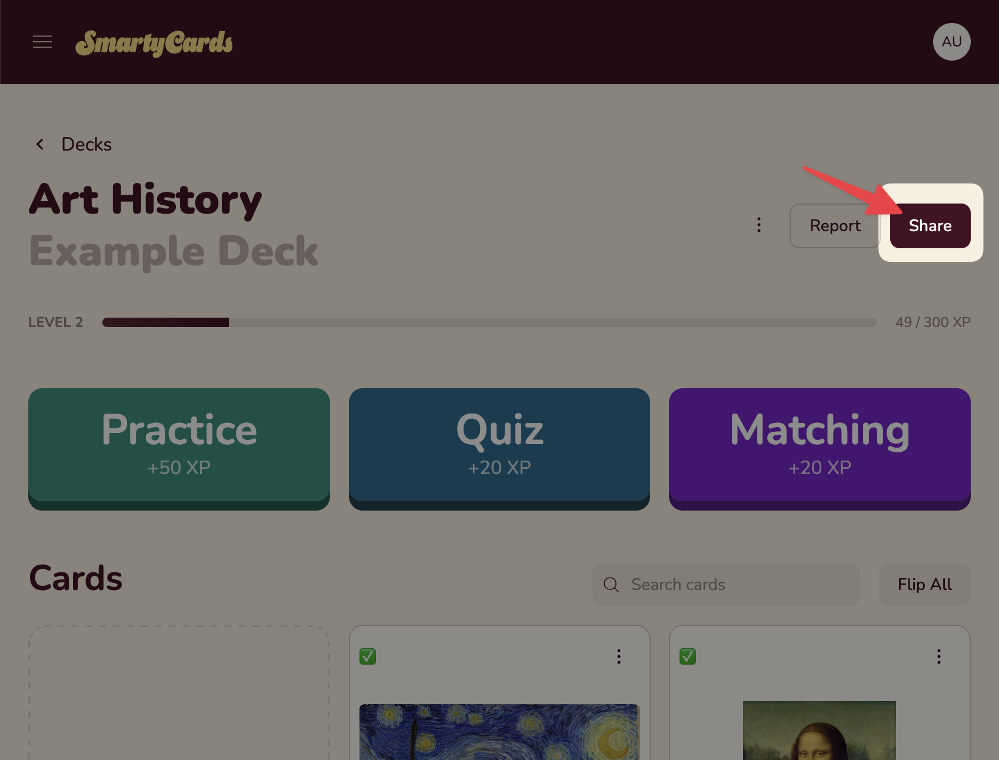
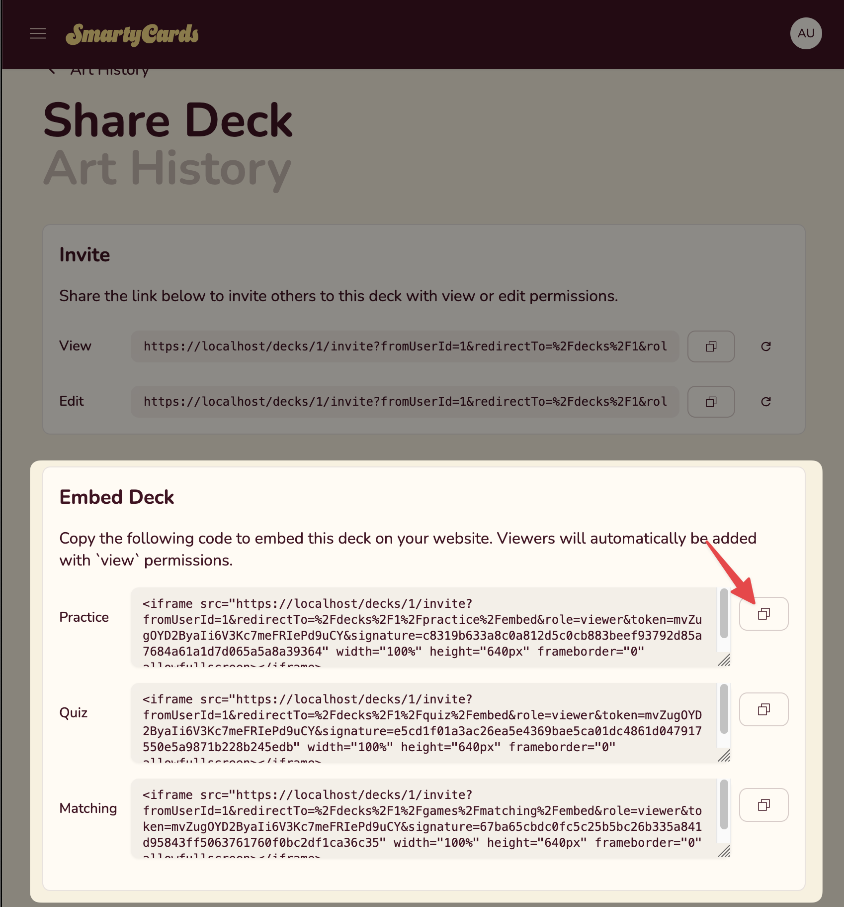
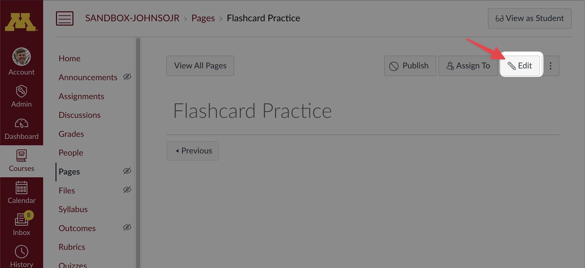
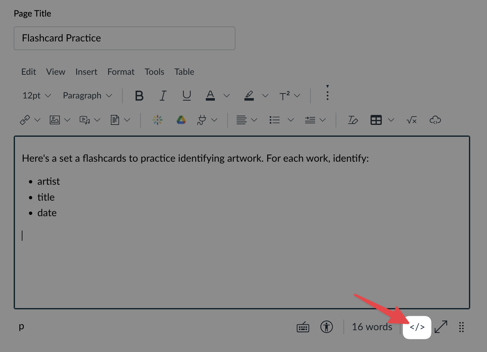
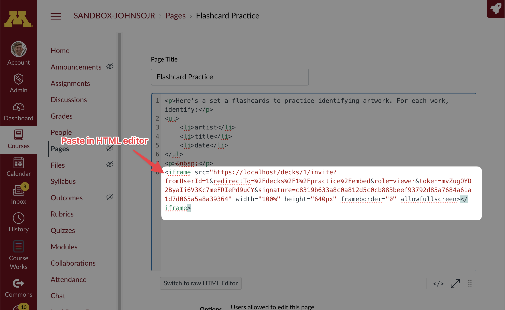
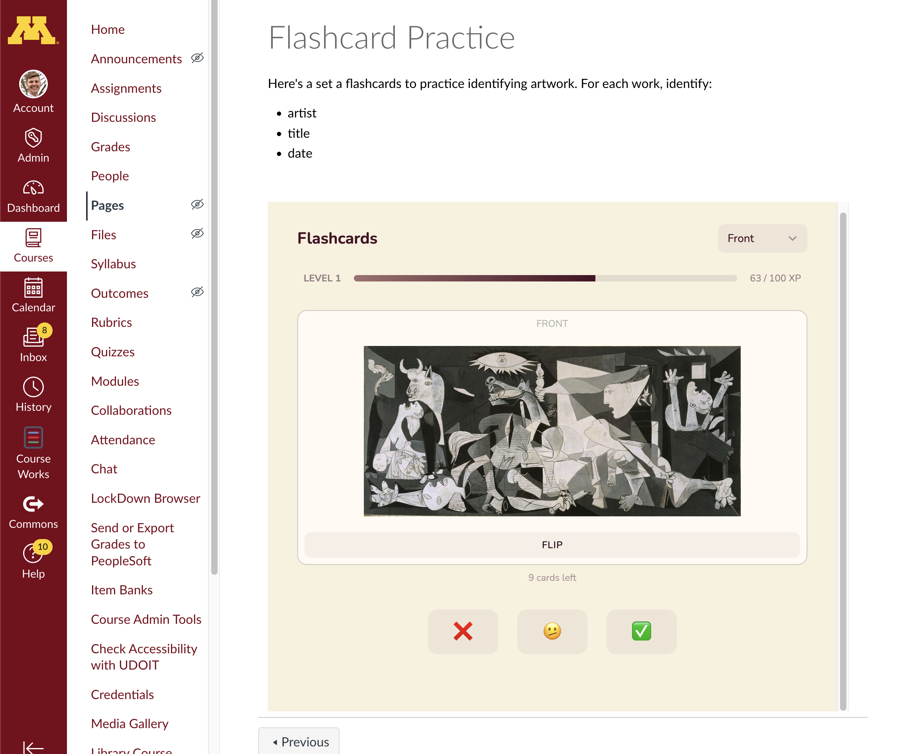

# Embedding Ungraded Activities in Canvas

Deck owners can also embed **ungraded** SmartyCards activities into any Canvas page.

This is a great option for instructors who want to provide students with easy access to practice activities without setting up formal assignments or grade passback.

::: info
For **graded** assignments with automatic grade passback to the Canvas gradebook, see [Using with Canvas (LTI Integration)](./lti-assignments-in-canvas.md).
:::

## Step by Step

To embed into a Canvas page:

1. Go your the SmartyCards deck, and click `Share`.

   

2. On the Share page, find the Embed Deck section. You will see embed code for each deck activity: [Practice (Flashcards)](../activities/practice-flashcards.md), [Quiz](../activities/quiz.md), [Matching](../activities/matching-game.md). **Copy the embed code** of the activity you wish to embed in Canvas.

   

3. Now, go to your Canvas classroom, and create or choose the page to place the embed:

   

4. In the editor, click the `</>` HTML Editor icon, to switch to HTML mode:

   

5. At the bottom, **paste your embed code**:

   

6. Click `Save`. Then you should see your embedded SmartyCards activity. (Or you may see page to sign-in to smartycards first, which will redirect you to the activity):

   

