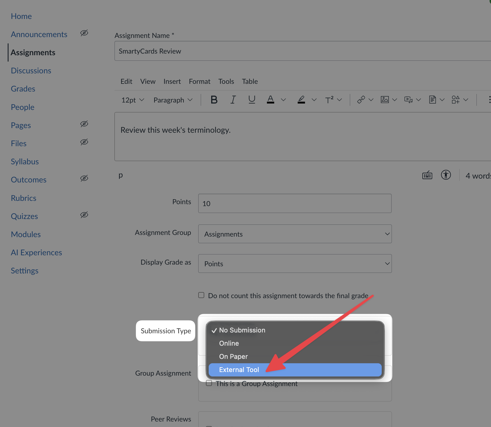
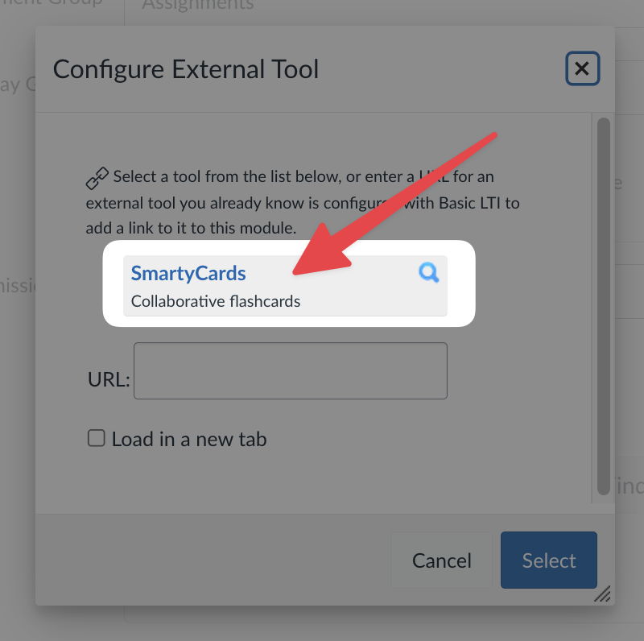
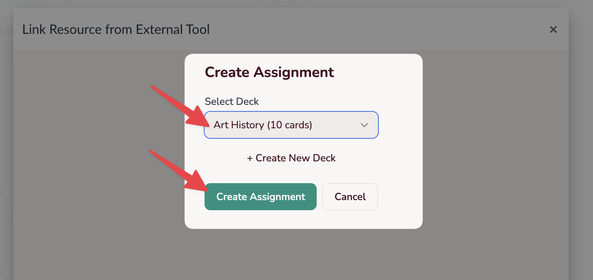
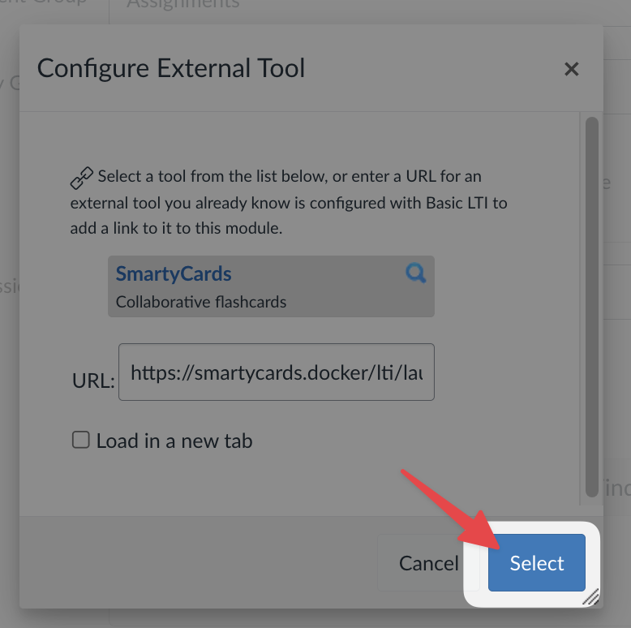
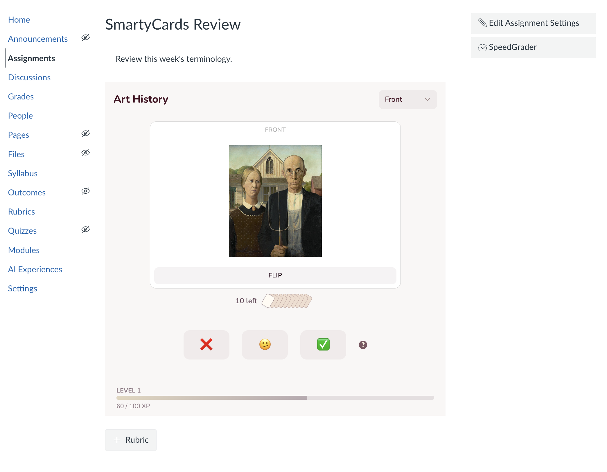
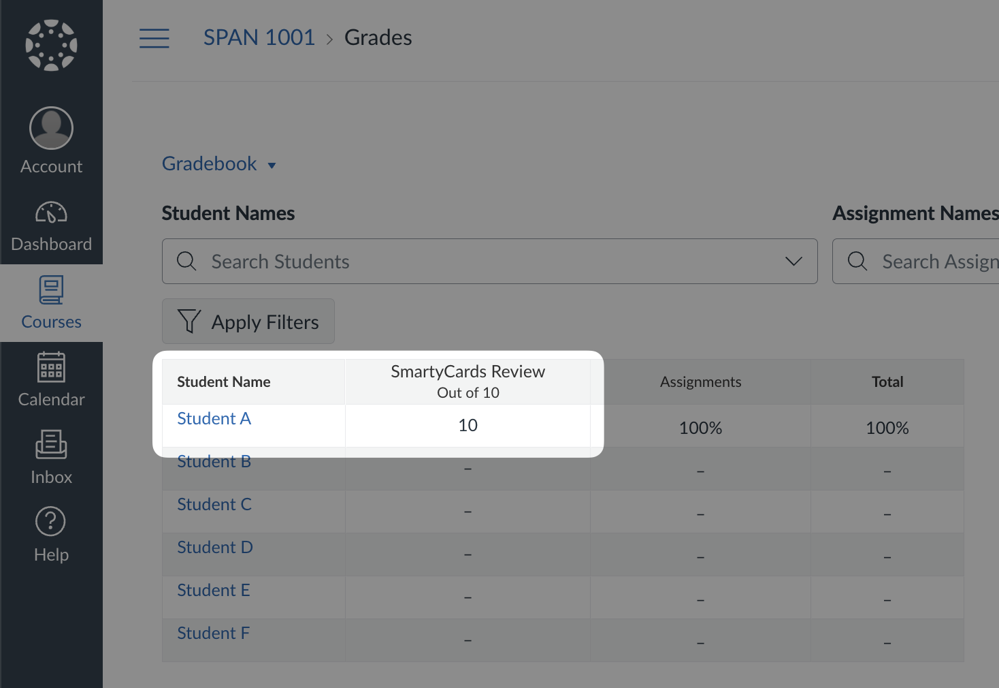

# Using with Canvas (LTI Integration)

SmartyCards can be integrated with Canvas using LTI (Learning Tools Interoperability). This allows you to **create assignments** that link directly to SmartyCards decks, with **automatic grade passback** to the Canvas gradebook.

## Setting Up an Assignment in Canvas

1. In Canvas, create a new **Assignment**. Add your assignment details (name, description, points, etc.).

2. For **Submission Type**, select **External Tool**

3. Click **Find** to see a list of available tools:

4. Choose **SmartyCards** from the list:

::: warning
Your Canvas administrator must first add and enable the SmartyCards LTI for your institution. If you don't see SmartyCards in the External Tool list, contact your Canvas admin or email <latistecharch@umn.edu>.
:::

5. **Choose the deck** you want to assign (or create a new deck), and click **Create Assignment**:

6. Click **Select** to confirm your choice:

7. **Save** the assignment

8. Your assignment is now set up. You should see it embedded in the assignment page (or a link to open SmartyCards in a new tab):

9. The assignment column is automatically created in the Gradebook. When a student completes their practice session, students will be awarded 100% for completing the activity:

### Student Experience

When students click the assignment:

1. They are taken directly to the SmartyCards practice activity
2. They practice all cards in the deck
3. Once complete, their grade (100%) is automatically submitted to Canvas

Students can return to the assignment to practice again, but their grade is recorded on first completion.

Students may also access the practice deck directly in SmartyCards, 

### How Grading Works

SmartyCards assignments are graded on **participation, not correctness**. Students earn 100% once they complete the practice session by going through all cards in the deck. The goal is to encourage practice and engagement, not to penalize students for getting answers wrong while learning.

If you have a large deck, consider breaking it into smaller decks for multiple assignments to make it more manageable for students.
