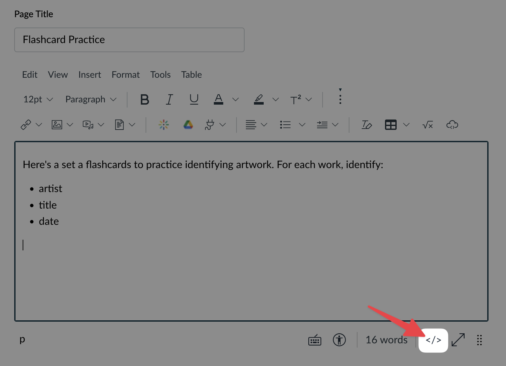

# Using with Canvas

SmartyCards activities can be embedded into any website, including Canvas. You will need to be a deck **owner** to access the embed code.

## Step by step

To embed into a Canvas page:

1. Go your the SmartyCards deck, and click `Share`.

   

2. On the Share page, find the Embed Deck section. You will see embed code for each deck activity: [Practice (Flashcards)](../activities/practice-flashcards.md), [Quiz](../activities/quiz.md), [Matching](../activities/matching-game.md). **Copy the embed code** of the activity you wish to embed in Canvas.

   

3. Now, go to your Canvas classroom, and create or choose the page to place the embed:

   

4. In the editor, click the `</>` HTML Editor icon, to switch to HTML mode:

   

5. At the bottom, **paste your embed code**:

   

6. Click `Save`. Then you should see your embedded SmartyCards activity. (Or you may see page to sign-in to smartycards first, which will redirect you to the activity):

   

7. To see participation and avg card difficulty,

## FAQ

- **How can I see participation and average card difficulty?**

  Use the [Deck Summary Report](./deck-summary-report.md) to see a summary of participation.

- **Can I set up a SmartyCards assignment to grade students for participation?**

  Not yet. It's something we're looking at, but we need more data on how SmartyCards is used a classroom setting. If you have thoughts on how you'd like this to work, email <latistecharch@umn.edu>.

- **Can students see one another's activity?**

  No. The deck summary report is only visible to deck owners.

- **I have another question/suggestion about using SmartyCards with Canvas!**

  We're always happy to help! Email <latistecharch@umn.edu>.
